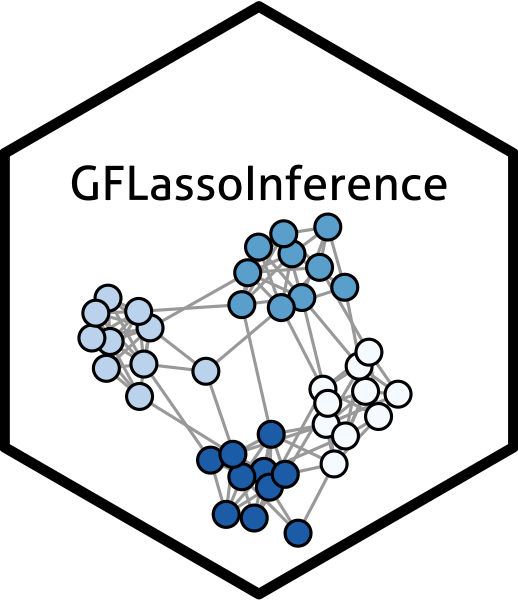

# GFLassoInference  

### What is GFLassoInference?

`GFLassoInference` is an `R` package for testing for a difference in means between a pair of connected components resulting from the graph fused lasso.

### How do I install the package?

To download the GFLassoInference package, use the code below.
```r
require("devtools")
devtools::install_github("yiqunchen/GFLassoInference")
library(GFLassoInference)
```
### Tutorials and Use

Visit https://yiqunchen.github.io/GFLassoInference/ for tutorials and examples. Please file an [issue](https://github.com/yiqunchen/GFLassoInference/issues) if you have a request for a tutorial that is not currently included.

### Citation

If you use `GFLassoInference` for your analysis, please cite our manuscript:

Chen YT, Jewell SW, Witten DM. (2022+) More powerful selective inference for the graph fused lasso. arXiv preprint. https://arxiv.org/abs/2109.10451.
 
### Bug Reports / Change Requests

If you encounter a bug or would like to make a change request, please file it as an issue [here](https://github.com/yiqunchen/GFLassoInference/issues).

### References

Chen YT, Jewell SW, Witten DM. (2021+) More powerful selective inference for the graph fused lasso. arXiv preprint. https://arxiv.org/abs/2109.10451.

Hyun S, G’Sell M, Tibshirani RJ. (2018) Exact post-selection inference for the generalized lasso path. Electron J Stat.

Tibshirani RJ, Taylor J. The solution path of the generalized lasso. Ann Stat. 2011;39(3):1335-1371. doi:10.1214/11-AOS878
