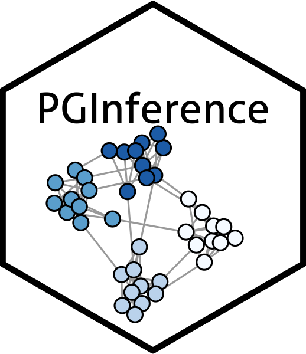

# GFLassoInference 

### What is GFLassoInference?

`GFLassoInference` is an `R` package for performing Powerful Graph fused lasso Inference.

### How do I install the package?

To download the GFLassoInference package, use the code below.
``` r
require("devtools")
devtools::install_github("yiqunchen/GFLassoInference")
library(GFLassoInference)
```

### Why do we need GFLassoInference?
One of the most fundamental task in statistics is to test for a difference the means between two groups &mdash; comparing vaccine efficacy between treatment and control groups, detecting the shift in copy numbers in chromosomes, to name a few. Classical hypothesis tests (e.g., z-test when the group variance is known) control the selective Type I error (i.e., the probability of a false rejection, *given that* the null hypothesis is tested) when the groups are defined a priori. However, in practice, we often find ourselves testing hypotheses generated by the same data, which leads to (extremely) inflated Type I error.

As a concrete example, the graph fused lasso estimator is widely used in practice to reconstruct underlying signals that are *piecewise constant*. The resulting estimate can be segmented into a partition known as the *connected components*, regions within which the estimate takes on the same value. Suppose we want to test whether the means between two groups are the same, then we need to carefully craft new procedures in lieu of a z-test, because now the groups are *defined through data*. 

To tackle this problem, Hyun et al. (2018) proposed the $p$-value $p_{\text{Hyun}}$ by conditioning on all the intermediate outputs of the algorithm used to obtain the graph fused lasso estimator. While their proposal is computationally efficient, we note that $p_{\text{Hyun}}$ conditions on too much information than what is necessary to come up with the hypothesis under consideration, therefore leading to (extremely) low power. 

Building on the low power observation, we propose an alternative $p$-value $p_{C_1,C_2}$ which conditions *only on the presence of two connected components being tested*. The resulting $p$-value will control the selective Type I error, while having higher power than $p_{\text{Hyun}}$. We demonstrate the increase in power in the figure below: in the leftmost panel, we plot the piecewise mean structure of the signal we are simulating from; in the middle panel, we see that under the null hypothesis, both $p_{\text{Hyun}}$ and $p_{C_1,C_2}$ control the selective Type I error, but the z-test $p_{\text{Naive}} = \mathbb{P}(|\nu^\top Y|\geq |\nu^\top y|)$ leads to inflated selective Type I error; finally, we demonstrate that $p_{C_1,C_2}$ has higher power than $p_{\text{Hyun}}$ across all values of the effect size ($|\nu^\top\beta|/\sigma$) considered. 

![Figure 1: (a): The piecewise mean structure of $\beta$ according to a two-dimensional grid graph. (b): Under the null hypothesis, both $p_{\text{Hyun}}$ and $p_{C_1,C_2}$ control the selective Type I error, but the z-test $p_{\text{Naive}} = \mathbb{P}(|\nu^\top Y|\geq |\nu^\top y|)$ leads to inflated selective Type I error. (c): For a given value of the effect size ($|\nu^\top\beta|/\sigma$), $p_{C_1,C_2}$ has higher power than $p_{\text{Hyun}}$. Power for both increases as a function of the effect size.](../man/figures/combined_two_d.png)


### Link to additional resources
* You can learn more about the technical details in our manuscript and in the [technical details section](https://yiqunchen.github.io/GFLassoInference/articles/technical_details.html).
* You can learn more about how to use our software in the  [tutorials section](https://yiqunchen.github.io/GFLassoInference/articles/Tutorials.html).
* Finally, code and steps to reproduce the figures in our manuscript can be found in the GitHub repo [https://github.com/yiqunchen/GFLassoInference-experiments](https://github.com/yiqunchen/GFLassoInference-experiments).

### Citation

If you use `GFLassoInference` for your analysis, please cite our manuscript:

Chen YT, Jewell SW, Witten DM. (2021+) More powerful selective inference for the graph fused lasso.

### Bug Reports / Change Requests

If you encounter a bug or would like to make a change request, please file it as an issue [here](https://github.com/yiqunchen/GFLassoInference/issues).

### References

Chen YT, Jewell SW, Witten DM. (2021+) More powerful selective inference for the graph fused lasso

Fithian W, Sun D, Taylor J. (2014) Optimal Inference After Model Selection. arXiv:1410.2597 [mathST]. 

Hyun S, G’Sell M, Tibshirani RJ. (2018) Exact post-selection inference for the generalized lasso path. Electron J Stat.

Lee JD, Sun DL, Sun Y, Taylor JE. Exact post-selection inference, with application to the lasso. Ann Stat. 2016;44(3):907-927. doi:10.1214/15-AOS1371


